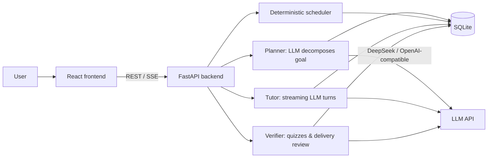

# PlanAgent

Turn a vague goal into a concrete daily plan. PlanAgent uses an LLM to break your goal into milestones and daily tasks, a deterministic scheduler to place them on the calendar, and a task-scoped AI tutor to help you learn along the way.

> 中文文档：[README.zh-CN.md](README.zh-CN.md)


## Features

- **Goal → plan**: an LLM decomposes any goal into milestones and daily tasks.
- **Duration-based scheduling**: pick a day/week/month deadline; tasks are spread evenly across the period, including weekends. If capacity is insufficient, the app tells you the shortest feasible duration.
- **Daily execution**: calendar view, one-click task completion, effort and type labels.
- **Calendar export**: download any plan as an iCal file and import it into your calendar app.
- **Verification**: learning tasks get a fresh 10-question quiz (70/100 to pass); practice/project tasks go through a delivery review. History is stored.
- **Task-scoped AI tutor**: persistent adaptive conversation (diagnose → explain → practice → remediate → ready), streaming replies, and switchable models.
- **Local-first**: single-user mode by default, no sign-in required; data lives in a local `planagent.db`.
- **Bring your own LLM**: switch between DeepSeek, OpenAI, Claude, and local Ollama from the first-run setup wizard.
- **Packaged desktop apps**: Windows and macOS builds published automatically from GitHub Actions.

## Screenshots

Coming soon — see [docs/screenshots](docs/screenshots) for the capture checklist and file layout.

## Quick start (downloaded app)

1. Download the archive for your platform from [Releases](../../releases) (`PlanAgent-v*`).
2. Run the app (Windows: `PlanAgent.exe`; macOS: `PlanAgent`). On first launch, a setup wizard walks you through choosing a provider (DeepSeek / OpenAI / Claude / Ollama) and entering your API key.
3. Start planning. Your browser opens automatically — no sign-up needed.

Your data is stored in `planagent.db` next to the app; back it up by copying that file. The setup wizard writes your provider choice and key to `planagent.conf`.

> macOS: if Gatekeeper blocks the unsigned app, right-click → Open, or run `xattr -dr com.apple.quarantine PlanAgent`.

## Run from source

### Backend

```bash
cd backend
pip install -r requirements.txt
export DEEPSEEK_API_KEY=sk-...
uvicorn app.main:app --reload --port 8000
```

### Frontend

```bash
cd frontend
npm install
npm run dev   # http://localhost:5173 (proxies /api to :8000)
```

## Configuration

All settings can be overridden with environment variables prefixed with `PLANAGENT_`:

| Variable | Description | Default |
| --- | --- | --- |
| `PLANAGENT_LLM_PROVIDER` | Provider: `deepseek` / `openai` / `anthropic` / `ollama` / `custom` | `deepseek` |
| `PLANAGENT_LLM_API_KEY` / `DEEPSEEK_API_KEY` | DeepSeek API key | empty |
| `PLANAGENT_LLM_MODEL` | Default model | `deepseek-v4-pro` |
| `PLANAGENT_LLM_MODELS` | Selectable models (comma-separated) | `deepseek-v4-pro,deepseek-chat,deepseek-reasoner` |
| `PLANAGENT_AUTH_ENABLED` | Enable account sign-in | `false` |
| `PLANAGENT_DATABASE_URL` | Database URL | local `planagent.db` |

The desktop build also reads a `planagent.conf` file next to the executable (see `planagent.conf.example`). Provider presets also accept the standard environment keys (`OPENAI_API_KEY`, `ANTHROPIC_API_KEY`, `DEEPSEEK_API_KEY`); local Ollama needs no key.

## Architecture

The LLM decides **what** to plan; a deterministic scheduler decides **when**. This separation keeps scheduling testable and makes plans reproducible.



### Project layout

```text
planagent/
├── backend/            FastAPI app (LLM, scheduler, services, API, tests)
├── frontend/           React + Vite app
├── docs/               Design and implementation docs
├── .github/            CI/CD workflows and PR template
├── planagent.conf.example
├── planagent.spec      PyInstaller packaging config
└── Dockerfile / docker-compose.yml
```

## Testing

```bash
cd backend && python -m pytest
cd frontend && npm test && npm run build
```

## Release process

Push a `v*` tag (e.g. `v1.0.0`) and GitHub Actions builds Windows and macOS packages and attaches them to a GitHub Release. You can also run the **Build desktop packages** workflow manually and grab the artifacts.

## Roadmap

- [ ] Screenshots and an online demo
- [ ] First-run setup wizard for API keys
- [ ] OpenAI, Claude, and local (Ollama) providers
- [ ] English UI
- [x] Calendar export (iCal)
- [ ] Calendar import
- [ ] Reminders
- [ ] Adaptive replanning when you fall behind
- [ ] Plan templates / community presets

## FAQ

- **Legacy database error `no column named user_id`?** The app auto-migrates older databases on startup — nothing to do.
- **Port 8000 already in use?** Stop the process using it, or switch ports and update the frontend proxy.
- **AI not responding?** Verify your DeepSeek API key in `planagent.conf` or the environment, and that your account has quota.

## Contributing

See [CONTRIBUTING.md](CONTRIBUTING.md).

## License

[MIT](LICENSE)
