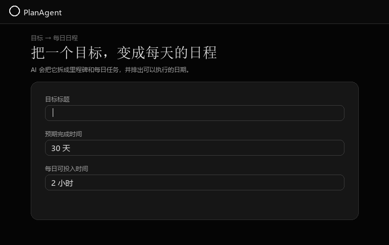

> English: [README](README.md)

# PlanAgent

目标驱动的规划 Web 应用：输入一个目标，AI 拆解成里程碑和每日任务，排程算法排出日程，支持勾选完成与「去检验」验证，并内置任务级 AI 导师。


## 功能特性

- **目标 → 计划**：LLM 把模糊目标拆成里程碑与每日任务，确定性算法排出日期。
- **时长排程**：按天/周/月设定完成时长，任务均匀铺满整个周期（含周末）；容量不足时给出最短建议。
- **每日执行**：日历视图、任务勾选、类型与耗时标记、检验入口。
- **日历导出**：把计划导出为 iCal 文件，可导入系统日历。
- **任务检验**：学习任务实时出 10 题（70 分通过），实操/项目走交付评审；检验历史存档。
- **任务级 AI 导师**：持久化自适应对话（诊断 → 讲解 → 练习 → 补强 → ready），流式回复，可切换模型。
- **自带 LLM 接入**：支持 DeepSeek、OpenAI、Claude 与本地 Ollama，首次运行引导页选择提供方并填写 Key。
- **本地优先**：默认本地单用户、无需登录；数据保存在本地 `planagent.db`。
- **中英双语界面**：顶部导航可随时切换语言，选择会被记住。
- **多端打包**：Windows / macOS 桌面版，GitHub Actions 自动构建发布。

## 界面预览



## 快速开始（下载版）

1. 从 [GitHub Releases](../../releases) 下载对应平台的压缩包（`PlanAgent-v*` 标签）。
2. 双击运行（Windows：`PlanAgent.exe`；macOS：`PlanAgent`）。首次启动会进入引导页，选择提供方（DeepSeek / OpenAI / Claude / Ollama）并填写 API Key。
3. 保存后即可开始规划，浏览器自动打开、无需登录。

数据保存在程序同目录的 `planagent.db`，备份时复制该文件即可。引导页会把提供方与 Key 写回 `planagent.conf`。

> macOS 首次打开若提示无法验证开发者：右键点击 → 打开，或执行 `xattr -dr com.apple.quarantine PlanAgent`。

## 从源码运行（开发）

### 后端

```bash
cd backend
pip install -r requirements.txt
export DEEPSEEK_API_KEY=sk-...
uvicorn app.main:app --reload --port 8000
```

### 前端

```bash
cd frontend
npm install
npm run dev   # http://localhost:5173（已代理 /api 到 :8000）
```

## 配置

所有配置都可经环境变量覆盖，前缀为 `PLANAGENT_`：

| 变量 | 说明 | 默认 |
| --- | --- | --- |
| `PLANAGENT_LLM_PROVIDER` | 提供方：`deepseek` / `openai` / `anthropic` / `ollama` / `custom` | `deepseek` |
| `PLANAGENT_LLM_API_KEY` / `DEEPSEEK_API_KEY` | DeepSeek API Key | 空 |
| `PLANAGENT_LLM_MODEL` | 默认模型 | `deepseek-v4-pro` |
| `PLANAGENT_LLM_MODELS` | 可选模型列表（逗号分隔） | `deepseek-v4-pro,deepseek-chat,deepseek-reasoner` |
| `PLANAGENT_AUTH_ENABLED` | 是否开启账号登录 | `false` |
| `PLANAGENT_DATABASE_URL` | 数据库连接 | 本地 `planagent.db` |

桌面版会读取程序同目录的 `planagent.conf`（参考 `planagent.conf.example`）。

## 排程规则

创建目标时输入正整数预期时长，并选择天、周或月。服务端以创建当天为开始日，计算并保存目标截止日期，再按任务顺序把计划均匀铺到整个自然日区间；周末也会安排任务。首个任务安排在当天，最后一个任务不晚于截止日。

创建目标时还可填写每日可投入时间，默认 2 小时。AI 会自行识别目标涉及的领域，把宽泛内容拆成以 0.5 小时为粒度的具体子任务；每天的任务数量可以不同，但累计预计耗时不会超过每日预算。若周期容量不足，系统不会创建计划，而会显示所需小时数和建议的最短天数。

学习任务的每次检验会重新生成 10 道题（7 道选择题、3 道简答题）。每题 10 分：选择题由服务端按正确答案计分，简答题由 AI 按评分点逐题计分；总分达到 70 分即通过。

`POST /api/goals` 使用 `duration_value` 与 `duration_unit`（`day` / `week` / `month`）。旧客户端仍可提交 `target_date`；未提供任何期限时保留按每日容量尽快安排的行为。

## AI 导师（学习任务）

学习类任务会显示「开始学习 / 继续学习」入口，进入任务级 AI 导师对话页。导师按「诊断 → 讲解 → 练习 → 补强 → ready」自适应推进，并持久化完整对话历史；刷新后可从上次进度继续，同一客户端消息不会重复调用模型。回复为流式输出，并可在左侧选择模型。

导师复用当前选定的 LLM 提供方（DeepSeek / OpenAI / Claude / Ollama），只接收滚动摘要和最近 12 轮对话；输入框按 Enter 发送、Shift+Enter 换行。`ready_for_verification` 仅为建议，不直接完成任务；任务仍由原有检验流程判定（学习任务为 10 题、总分 70 分通过），通过后才会标记完成。

当前版本不包含联网检索、文件上传、语音、多用户或全局导师。

## 测试

```bash
cd backend && python -m pytest
cd frontend && npm test && npm run build
```

## 发布流程

推送 `v*` 标签（例如 `v1.0.0`）后，GitHub Actions 会自动构建 Windows 与 macOS 安装包，并挂到 GitHub Releases；也可以手动触发 **Build desktop packages** 工作流，在 Artifacts 中下载。

### 代码签名（可选）

官方发布包默认未签名，Windows 首次运行可能提示“未知发布者”，macOS 可能提示“无法验证开发者”（处理方式见上文）。在仓库设置中配置对应的 secrets 后，构建时会自动签名；未配置的签名步骤会被自动跳过，不影响正常构建：

| 平台 | 需要的 Secrets | 方式 |
| --- | --- | --- |
| macOS | `AC_CERTIFICATE_BASE64`、`AC_P12_PASSWORD`、`APPLE_CERT_NAME` | Apple Developer 证书（`codesign`） |
| Windows | `AZURE_TENANT_ID`、`AZURE_CLIENT_ID`、`AZURE_CLIENT_SECRET`、`AZURE_KEY_VAULT_NAME`、`AZURE_CERT_NAME` | Azure 受信任签名 |
| Windows（自签名） | `WINDOWS_PFX_BASE64`、`WINDOWS_PFX_PASSWORD` | `.pfx` 证书 + `signtool`（只能减少“未知发布者”提示，无法消除 SmartScreen） |

更多安全说明见 [SECURITY.md](SECURITY.md)。

## 部署（自托管）

```bash
export PLANAGENT_AUTH_SECRET=$(openssl rand -hex 32)
export PLANAGENT_LLM_API_KEY=sk-...
docker compose up -d --build
```

- 应用监听 `8000`；前端静态文件由后端一并托管。
- 数据保存在 Docker 卷 `planagent-data`，升级容器不丢数据。
- 对外公开请在前面加 HTTPS 反向代理（Caddy / Nginx）。
- 默认本地单用户模式；如开启账号（`PLANAGENT_AUTH_ENABLED=true`），第一个注册账号会自动接管遗留数据。

## 常见问题

- **旧数据报错 `no column named user_id`**：新版启动时会自动迁移旧数据库，无需手动处理。
- **8000 端口被占用**：先停止占用进程再启动，或改用其他端口并同步修改前端代理。
- **AI 无响应 / 报错**：确认 `planagent.conf` 或环境变量中的 DeepSeek API Key 正确、账户有额度。

## 目录结构

```text
planagent/
├── backend/            FastAPI 后端（LLM、排程、服务、API、测试）
├── frontend/           React + Vite 前端
├── docs/               设计与实施文档
├── .github/            CI/CD 与 PR 模板
├── planagent.conf.example
├── planagent.spec      PyInstaller 打包配置
└── Dockerfile / docker-compose.yml
```

## 贡献

欢迎参与，请阅读 [CONTRIBUTING.md](CONTRIBUTING.md)。

## License

[MIT](LICENSE)
